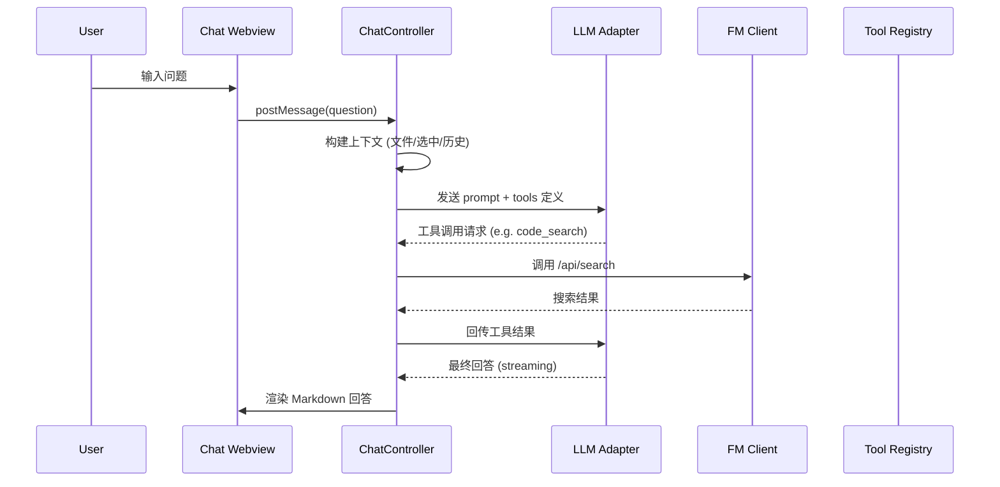
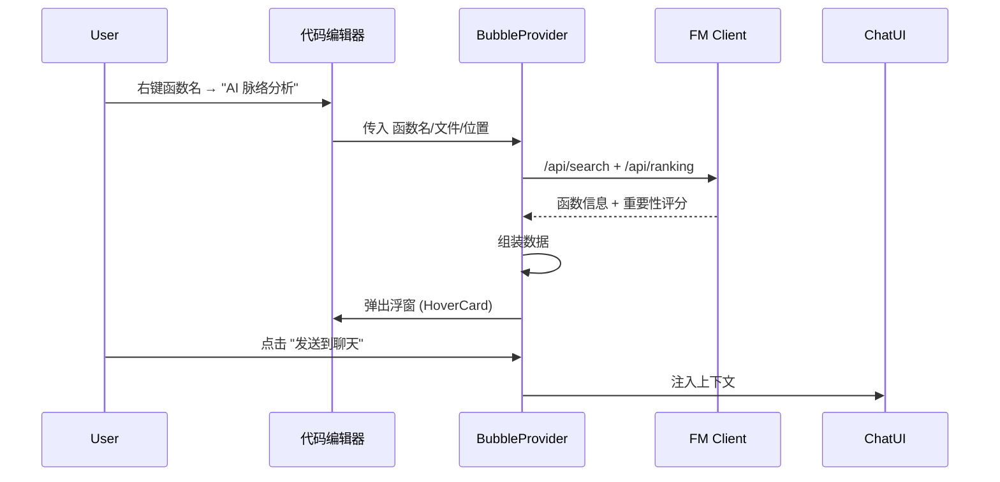

# Githave VSCode 插件 — 头脑风暴与架构设计

## 一、总体愿景

> **推进 VS Code 插件生态建设**：开发覆盖编码全流程的辅助工具，包含智能问答、多轮推理、原生工具调用及代码检索。创新性引入"气泡浮窗"交互模式，提供即时的代码诊断与脉络梳理，深度融入开发者的沉浸式编码工作流。

---

## 二、头脑风暴：核心能力矩阵

### 🧠 AI 智能聊天面板（Sidebar Chat Panel）

| 能力 | 描述 |
|------|------|
| **Act 模式** | 直接执行：AI 自主完成代码编写、修改、重构等操作 |
| **Plan 模式** | 先规划后执行：AI 先生成分步计划供用户审批，确认后逐步实施 |
| **多轮深度思考** | 基于上下文的多轮对话，支持链式推理 (Chain-of-Thought)，允许 AI 自我反思、分步拆解 |
| **原生工具调用** | 调用 FM 后端 API（代码搜索、索引构建、模块图谱、函数排名等）作为 AI 的内置工具 |
| **联网搜索** | 集成 Web Search，回答超出当前代码库范围的技术问题 |
| **上下文感知** | 自动注入当前打开文件、选中代码、光标位置、工作区信息 |

### 🫧 气泡浮窗交互（Bubble Hover Widget）

这是本插件的**核心创新点**，右键菜单或 Hover 触发即可弹出：

| 触发目标 | 信息展示 |
|----------|----------|
| **函数** | AI 摘要、调用链上下游（FanIn/FanOut）、复杂度评分、代码诊断建议 |
| **文件** | 文件角色定位、模块归属、导出接口概览、对外依赖关系 |
| **目录/模块** | 模块架构总览、子模块拓扑、函数统计、依赖热力图 |

浮窗支持：
- **固定 (Pin)** 到编辑器侧边，形成持久参考面板
- **深入 (Drill-Down)** 点击函数名跳转到其气泡详情
- **发送到聊天** 将当前浮窗内容作为上下文注入聊天面板

### 🔧 FM 后端集成（FlashMemory API）

基于 `docs/README.md` 文档，插件将调用以下核心 API：

| API | 插件用途 |
|-----|----------|
| `POST /api/search` | 聊天中的代码检索工具、气泡浮窗中的引用查找 |
| `POST /api/functions` | 函数列表获取，气泡浮窗的数据源 |
| `POST /api/index` | 首次打开项目时自动/手动构建索引 |
| `POST /api/index/incremental` | 文件保存时触发增量索引更新 |
| `POST /api/index/check` | 校验索引状态，确定是否需要重建 |
| `POST /api/module-graphs` | 获取模块图谱用于气泡浮窗的目录分析 |
| `POST /api/module-graphs/update` | 异步触发模块图谱更新 |
| `POST /api/ranking` | 函数重要性评级，用于气泡浮窗展示 |
| `POST /api/llm/analyzer` | LLM 代码分析，增强气泡浮窗的智能诊断 |

---

## 三、架构方案对比

### 方案 A：Webview + 本地 LLM 代理（✅ 推荐）

```
┌──────────────────────────────────────────────┐
│                 VSCode 插件                   │
│  ┌──────────┐  ┌───────────┐  ┌───────────┐ │
│  │ Chat     │  │ Bubble    │  │ Status    │ │
│  │ Webview  │  │ HoverCard │  │ Bar       │ │
│  └────┬─────┘  └─────┬─────┘  └─────┬─────┘ │
│       │              │              │        │
│  ┌────▼──────────────▼──────────────▼─────┐  │
│  │         Extension Host (核心层)         │  │
│  │  ┌─────────────┐  ┌─────────────────┐  │  │
│  │  │  FM Client  │  │  LLM Adapter    │  │  │
│  │  │  (API 调用)  │  │  (多模型适配)    │  │  │
│  │  └──────┬──────┘  └───────┬─────────┘  │  │
│  └─────────┼─────────────────┼────────────┘  │
└────────────┼─────────────────┼───────────────┘
             │                 │
     ┌───────▼──────┐  ┌──────▼──────┐
     │ FM Server    │  │ LLM Server  │
     │ :5532        │  │ (可配置)     │
     └──────────────┘  └─────────────┘
```

**优点**：Chat Webview 自由度高、体验好；FM 直连、延迟低
**缺点**：Webview 开发工作量较大，需要维护前端状态

### 方案 B：纯原生 VSCode UI

使用 TreeView + QuickPick + InputBox + 信息浮窗，不使用 Webview。

**优点**：开发速度快，原生体验
**缺点**：聊天面板的交互能力极其有限，无法实现富文本/Markdown 渲染  

### 方案 C：混合方案

Chat 面板用 Webview；气泡浮窗用原生 `vscode.Hover` + `MarkdownString`。

**优点**：兼顾开发效率和用户体验
**缺点**：两种 UI 范式的一致性需要额外处理

> **推荐方案 A**：全 Webview 方案虽然开发量较大，但对于"AI 编程助手"这一品类，丰富的交互能力是核心竞争力。气泡浮窗可以先从原生 Hover 起步，后续迭代为浮动 Webview Panel。

---

## 四、模块划分

```
githave-vscode/src/
├── extension.ts              # 主入口，注册所有功能
├── core/
│   ├── fm-client.ts          # FlashMemory HTTP API 客户端
│   ├── llm-adapter.ts        # LLM 模型适配层（支持多后端）
│   ├── tool-registry.ts      # 原生工具注册中心
│   └── context-builder.ts    # 上下文构建器（文件/选中/光标）
├── chat/
│   ├── chat-provider.ts      # Chat Webview Provider
│   ├── chat-controller.ts    # 聊天逻辑控制器（Act/Plan 模式）
│   ├── message-handler.ts    # 消息流处理（含 streaming 支持）
│   └── webview/              # Chat UI HTML/CSS/JS 资源
│       ├── index.html
│       ├── chat.css
│       └── chat.js
├── bubble/
│   ├── bubble-provider.ts    # 气泡浮窗 Provider
│   ├── function-bubble.ts    # 函数级气泡
│   ├── file-bubble.ts        # 文件级气泡
│   ├── module-bubble.ts      # 目录/模块级气泡
│   └── bubble-actions.ts     # 浮窗交互操作（Pin/DrillDown/SendToChat）
├── index/
│   ├── index-manager.ts      # 索引生命周期管理
│   └── index-watcher.ts      # 文件变更监听 → 增量索引
├── views/
│   ├── status-bar.ts         # 底部状态栏（索引状态/FM 连接状态）
│   └── tree-view.ts          # 侧边栏树形视图（模块浏览）
└── utils/
    ├── config.ts             # 插件配置读取
    ├── logger.ts             # 日志工具
    └── constants.ts          # 常量定义
```

---

## 五、核心交互流程

### 5.1 聊天流程（Act 模式）



### 5.2 气泡浮窗流程



---

## 六、开发路线图

| 阶段 | 里程碑 | 预计周期 |
|------|--------|----------|
| **P0** | FM Client + 索引管理 + 基础 Chat Webview (文本问答) | 1-2 周 |
| **P1** | Act/Plan 模式 + 工具调用 (search/index) + 流式响应 | 1-2 周 |
| **P2** | 气泡浮窗 v1（函数级，原生 Hover） | 1 周 |
| **P3** | 气泡浮窗 v2（文件/模块级 + 可视化图谱） | 1-2 周 |
| **P4** | 多轮深度思考 + 联网搜索 + 高级上下文管理 | 1-2 周 |
| **P5** | 打磨 UI/UX + 性能优化 + 打包发布 | 1 周 |

---

## 七、用户需确认的几个关键问题

1. **LLM 后端选择**：你计划使用哪个 LLM？（例如 OpenAI API / 本地 Ollama / 自建模型服务？）这会影响 `llm-adapter.ts` 的设计。
2. **FM 服务地址**：FM 服务是否固定运行在 `localhost:5532`？还是需要用户自行配置？
3. **P0 优先级确认**：是否同意先以 FM Client + 基础 Chat 为第一个里程碑？还是你更希望先做气泡浮窗？
